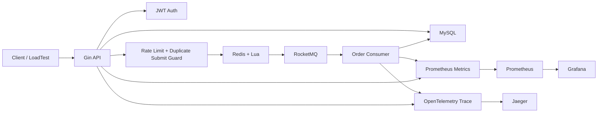
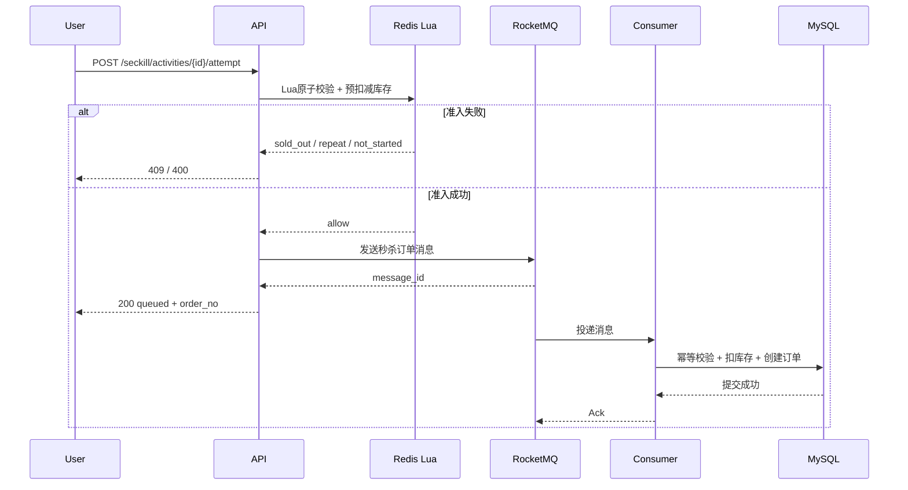
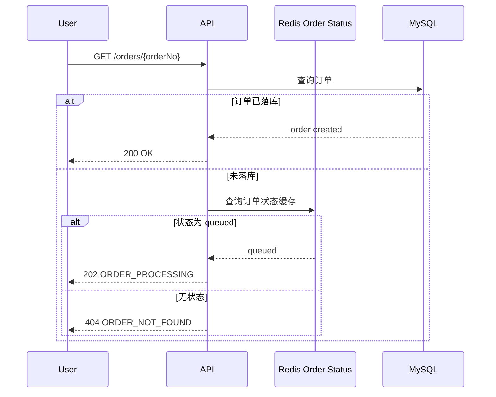
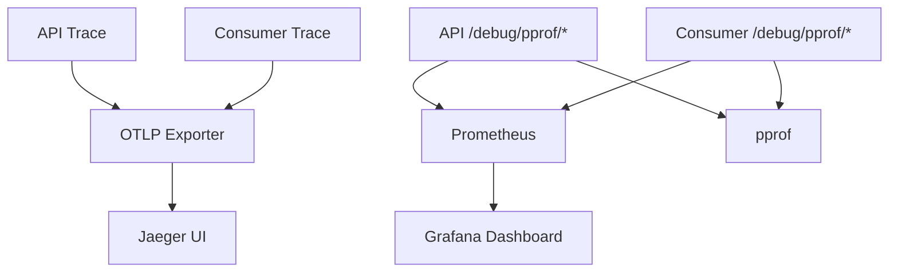

# go-seckill 架构图与时序图版

## 1. 系统总览

## 2. 秒杀主链路

## 3. 订单查询链路

## 4. 可观测链路

## 5. 面试时如何配合图来讲

### 总图怎么讲

先讲系统分层：

1. Gin 对外提供 HTTP API
2. Redis + Lua 负责秒杀高并发准入
3. RocketMQ 负责削峰填谷
4. Consumer 负责异步落库
5. MySQL 负责最终一致性
6. Prometheus / Grafana / Jaeger / pprof 负责可观测

### 主链路图怎么讲

先说同步版做过什么，再说为什么升级成异步版：

- 同步版容易理解，但高并发下数据库压力大
- 所以后来把准入前置到 Redis Lua
- 再把下单写库改成 RocketMQ 异步消费
- 这样 API 返回更快，数据库压力更可控

### 查询链路图怎么讲

这里重点突出异步系统的用户体验设计：

- API 先返回 queued
- 订单未落库时不直接返回 404
- 通过 Redis 状态缓存返回 `202 ORDER_PROCESSING`

这能说明你不仅关注后端吞吐，也关注真实用户体验。
